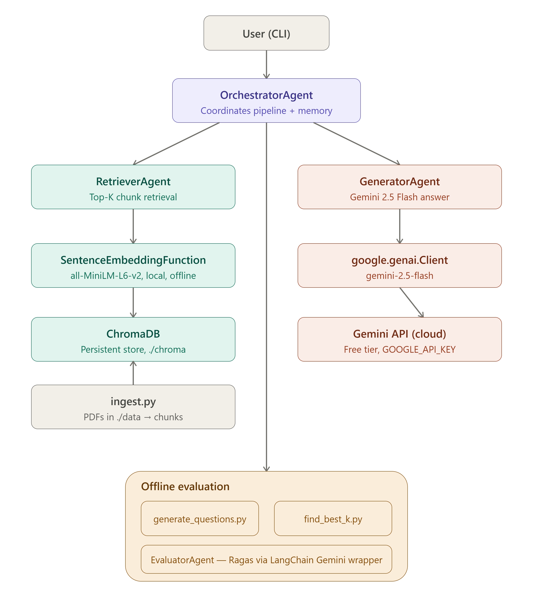

# Multi-Agent RAG Chatbot — AIS Documents

A multi-agent Retrieval-Augmented Generation (RAG) chatbot that answers questions about Automotive Industry Standards (AIS) documents published by ARAI (Automotive Research Association of India). The system retrieves relevant passages from a local vector database and generates grounded answers using Google's Gemini 2.5 Flash model.

---

## What it does

You give it a folder of AIS PDF documents. It chunks them, embeds them locally, and stores them in a vector database. When you ask a question, it retrieves the most relevant chunks and asks Gemini to answer strictly from that context, so answers are grounded in the actual documents instead of the model's general knowledge.

---

## Architecture

The system is split into four agents, each with one job:

```
User Query
    │
    ▼
OrchestratorAgent              ← coordinates pipeline + manages memory
    ├── RetrieverAgent         ← all-MiniLM-L6-v2 (local) → ChromaDB
    └── GeneratorAgent         ← Gemini 2.5 Flash (google.genai.Client)

EvaluatorAgent                 ← Ragas metrics via LangChain Gemini wrapper
```

### Agent responsibilities

| Agent | Input | Output | Role |
|---|---|---|---|
| **OrchestratorAgent** | user query | answer dict + retrieved chunks | Coordinates the pipeline, holds short-term conversation memory |
| **RetrieverAgent** | query string | top-K relevant chunks from ChromaDB | Finds the passages relevant to the question |
| **GeneratorAgent** | query + chunks + history | grounded answer string | Calls Gemini 2.5 Flash to produce the answer |
| **EvaluatorAgent** | questions JSON path | Ragas metrics DataFrame + CSV | Scores chatbot quality on faithfulness, relevance, precision, recall |

### Memory model

- **Short-term**: a list of `{role, content}` turns held in `OrchestratorAgent.history`. Cleared with `reset_memory()` or the `reset` command. Not persisted to disk.
- **Long-term**: the ChromaDB collection on disk. Built once by `ingest.py` and persists across runs.

---

## Models and tools used

| Purpose | Model / library | Where it runs | Cost |
|---|---|---|---|
| Answer generation | `gemini-2.5-flash` | Google's Gemini API (cloud) | Free tier |
| Embeddings | `all-MiniLM-L6-v2` (`sentence-transformers`) | Locally, on your machine | Free, no API calls |
| Vector storage | ChromaDB (`PersistentClient`) | Locally, on disk | Free |
| PDF parsing | PyMuPDF (`fitz`) | Locally | Free |
| Evaluation metrics | Ragas, via `langchain-google-genai` wrappers around Gemini | Cloud (LLM calls) + local (scoring) | Free tier |

Because embeddings run locally, **ingestion and chatting only need a Gemini API key for the generation step** — retrieval works without any API calls at all.

Get a free key at **https://aistudio.google.com/app/apikey**

---

## Multi-Agent RAG Architecture

<p align="center">
  
</p>

## Project structure

```
multiagent_chatbot/
├── main.py                    # CLI entry point
├── requirements.in            # top-level dependencies
├── requirements.txt           # pinned, pip-compile generated
├── assets/
│   └── multiagent_rag_architecture.png   # system architecture diagram
└── app/
    ├── config.py               # all settings in one place
    ├── ingest.py               # PDF → chunks → ChromaDB pipeline
    ├── generate_questions.py   # synthetic Q&A generation for evaluation
    ├── find_best_k.py          # Precision/Recall/MRR sweep over K values
    └── agents/
        ├── __init__.py
        ├── orchestrator.py     # pipeline coordinator + short-term memory
        ├── retriever.py        # ChromaDB + local sentence-transformer embeddings
        ├── generator.py        # Gemini 2.5 Flash answer generation
        └── evaluator.py        # Ragas evaluation
```

Created at runtime, not shipped in the repo:

```
├── data/        # put your AIS PDFs here before running ingest.py
├── chroma/      # auto-created by ingest.py
├── app/eval/    # auto-created by generate_questions.py / find_best_k.py
└── .env         # holds GOOGLE_API_KEY
```

---

## Setup

```bash
# 1. Unzip / clone the project
cd multiagent_chatbot

# 2. Create a virtual environment
python -m venv venv
source venv/bin/activate        # Windows: venv\Scripts\activate

# 3. Install dependencies
pip install -r requirements.txt

# 4. Set your Gemini API key
echo "GOOGLE_API_KEY=your_key_here" > .env

# 5. Add PDFs
mkdir -p data
# Download AIS documents from: https://www.araiindia.com/downloads/ais-downloads
# and place them in data/

# 6. Ingest documents — builds the vector store
cd app
python ingest.py
# First run downloads the all-MiniLM-L6-v2 model (~80MB) — no API key needed for this step

# 7. Start chatting
cd ..
python main.py
```

---

## Usage

```
============================================================
  Multi-Agent RAG Chatbot — AIS Documents  (Gemini 2.5 Flash)
  Commands: 'quit' to exit | 'reset' to clear chat history
============================================================

You: What is the scope of AIS-004?
Assistant: ...

[Sources: AIS-004.pdf]
```

- Type a question and press Enter to chat.
- Type `reset` to clear conversation memory and start a fresh session.
- Type `quit` to exit.

---

## Configuration (`app/config.py`)

| Setting | Default | Description |
|---|---|---|
| `LLM_MODEL` | `gemini-2.5-flash` | Gemini model used for generation |
| `CHROMA_PATH` | `<project_root>/chroma` | Resolved with `pathlib`, relative to `config.py` |
| `DATA_PATH` | `./data` | Folder ingest.py reads PDFs from |
| `CHUNK_SIZE` | `500` | Words per chunk |
| `CHUNK_OVERLAP` | `50` | Word overlap between consecutive chunks |
| `TOP_K` | `5` | Number of chunks retrieved per query |
| `COLLECTION_NAME` | `ais_documents` | ChromaDB collection name |

The embedding model name (`all-MiniLM-L6-v2`) is hardcoded inside the `SentenceEmbeddingFunction` class in `retriever.py` and `ingest.py`, rather than configured centrally.

---

## Blockers / known issues

These are the current limitations of the project as it stands.

1. **Evaluation pipeline does not run — dependency conflicts.** Attempting to run the Ragas-based evaluation (`EvaluatorAgent`) or `find_best_k.py` fails due to dependency resolution issues in the installed environment. As a result, the chatbot has only been verified for direct chat use, **end-to-end evaluation (faithfulness, relevancy, precision, recall) has not been successfully run.**

2. **`generate_questions.py` is broken.** It still imports `GeminiEmbeddingFunction` from `agents/retriever.py`, but that class was renamed to `SentenceEmbeddingFunction` when embeddings moved to `sentence-transformers`. It also calls `genai.GenerativeModel(...)`, which belongs to the older `google.generativeai` package — the project now uses the newer `google.genai` package, where generation goes through `genai.Client(...).models.generate_content(...)` instead. This script will not run until both are updated to match the pattern used in `generator.py`.

3. **No automated test coverage.** There are no unit or integration tests, so changes to any agent currently rely on manual verification through the CLI.

4. **Current Status:** The complete chatbot pipeline is now functional end-to-end. Document ingestion (`ingest.py`), vector storage with ChromaDB, retrieval using SentenceTransformers, and answer generation using Gemini 2.5 Flash have been tested and are working through `main.py`. The evaluation utilities (`generate_questions.py`, `find_best_k.py`, and `EvaluatorAgent`) are included in the codebase and may require additional validation or updates to align with the latest architecture.
